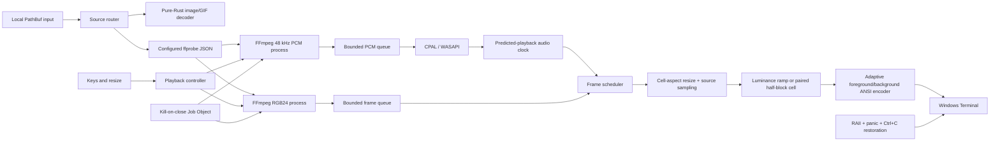

# Proof-of-concept architecture



## Boundaries

- `media` owns probing, process argument construction, raw-pipe readers, and
  bounded decoder queues. FFmpeg and ffprobe inputs use a local-only protocol
  whitelist. The module does not know about terminal rendering.
- `audio` owns device negotiation, the real-time callback, mute/pause state, and
  the audio clock. The callback never blocks, logs, or invokes FFmpeg.
- `playback` owns decoder generations, pause/seek/restart, frame deadlines, and
  late-frame dropping. It retains at most three local video frames; the decoder
  channel retains at most two more, so pause and fast decoding cannot turn into
  an unbounded frame cache.
- `render` owns aspect fitting, source sampling, luminance-to-glyph mapping,
  paired half-block cells, and full/delta/row-run ANSI encoders. The four
  character modes select a luminance-to-glyph ramp. Colored Half-Block instead
  selects two vertical RGB samples per cell; color capability and ANSI update
  strategy remain independent.
- `terminal` owns raw mode, alternate-screen state, input events, batched writes,
  and idempotent restoration.
- `platform::windows` owns local-drive path enforcement, hidden child creation,
  and Job Object containment.

The `media` contracts deliberately use Rust frames, PCM chunks, timestamps, and
events rather than FFmpeg types. A future linked-FFmpeg backend can therefore
replace the subprocess implementation without rewriting the clock, scheduler,
renderer, or controller.

## Synchronization model

FFmpeg's raw-video pipe has no per-frame timestamps, so the POC intentionally
normalizes video to a constant output rate. A frame's timestamp is:

```text
absolute seek target + decoded frame index / normalized FPS
```

The audio callback records CPAL's predicted device playback instant together
with the first media sample frame in each callback buffer. The main thread maps
the current stream clock onto that anchor. This accounts for scheduled WASAPI
buffering more accurately than counting data as soon as it leaves FFmpeg.

A frame is renderable up to half a frame interval early. When more than one frame
is queued, frames over 1.5 intervals late are discarded. Ordinary drift never
causes a decoder seek.

When the PCM producer disconnects and the callback consumes the final complete
stereo frame, it marks the audio stream drained. Playback anchors its monotonic
wall clock to the last audio position so a video whose audio track ends first
can complete instead of freezing.

Seek cancels the current generation, drops the audio stream, terminates the Job
Object, joins both pipe readers, starts both FFmpeg processes at one absolute
target, prebuffers audio, resets the clock, and resumes the prior pause/mute
state.

Image decoding, FFmpeg version/configuration validation, and `ffprobe` run
before raw mode or the alternate screen is entered. Decoder processes are
started afterward in a kill-on-close Job Object. This keeps synchronous,
potentially slow input validation out of altered terminal state.

PNG and JPEG decoding applies strict 4096x4096 dimension limits and a 128 MiB
decoder allocation budget. GIF decoding applies the same dimension limits and a 256 MiB decoder
allocation budget. Frames are decoded incrementally and rejected before
retention when the animation would exceed 10,000 frames or 256 MiB of decoded
RGB data. The resulting bounded frame vector remains in memory to support
looping without reopening the source.

UNC paths, device paths, and mapped network drives are rejected before path
metadata is read; the same local-drive check is repeated after canonicalization.
Every ffprobe, video-decoder, and audio-decoder input is preceded by
`-protocol_whitelist file,pipe`. The top-level media path is local, and nested
playlist or manifest resolution cannot opt into HTTP or other network
protocols. Paths remain separate operating-system arguments; no shell string is
constructed.

For an interactive video launch without `--display-mode`, the application enters
one guarded terminal session after probing and shows the five-mode selector.
Number keys select immediately, Enter selects Default, and cancellation drops
the same RAII session without starting decoder processes. An explicit mode, a
non-interactive stdin, or a non-video source resolves deterministically without
showing the menu.

The Default ramp remains ` .:-=+*#%@`, preserving the renderer that existed
before display-mode selection. Classic ASCII is intentionally the same exact
ramp because that is also the product-specified Classic ramp. Detailed ASCII is
the longer ASCII density ramp; Gradient uses single-column Unicode shade
characters. Cells retain a compact one-byte glyph code, and the ANSI encoder
expands Unicode shades to UTF-8 while cursor coordinates continue to count
terminal cells rather than bytes.

Colored Half-Block is menu option `5` and CLI value
`--display-mode half-block`. After the ordinary aspect fit determines the
terminal grid, it samples a logical source grid with twice as many vertical
rows. Each output cell stores the centered upper sample as foreground, the
centered lower sample as background, and renders `▀` (U+2580). A one-row source
therefore duplicates its only pixel safely, while odd-height inputs still
sample both the upper and lower image regions.

In truecolor mode the encoder emits `38;2` foreground and `48;2` background
sequences. In 256-color mode it quantizes both samples independently and emits
`38;5` and `48;5`. The deterministic monochrome fallback compares each sample's
BT.709 luminance with 128 and selects space for dark/dark, `▀` for bright/dark,
`▄` for dark/bright, or `█` for bright/bright.

The `Cell` equality used by delta and row-run detection includes the background,
so changing only the lower sample still redraws the cell. Full, delta, row-run,
and adaptive strategies all use the same paired-color path, and image, GIF, and
video playback all share the sampler. Colored backgrounds are reset at row or
run boundaries and at the end of each encoded frame. The selector, terminal
session, resize clear, status line, and final restoration also establish reset
boundaries, preventing a Half-Block background from bleeding into UI text or
the restored PowerShell prompt.

## Known POC limitations

- Variable-frame-rate timing is normalized and cannot preserve every source PTS.
- Process assignment has a small spawn-to-Job-Object race because `std::process`
  does not create the child suspended.
- CPAL timestamp-based scheduling still needs external flash/click capture to
  prove end-to-end A/V skew.
- Animated GIFs are preloaded into memory within the documented safety limits.
- A hard process kill cannot execute RAII or panic cleanup.
- Windows Terminal pixel cell dimensions are not assumed; the default cell
  aspect is configurable.
